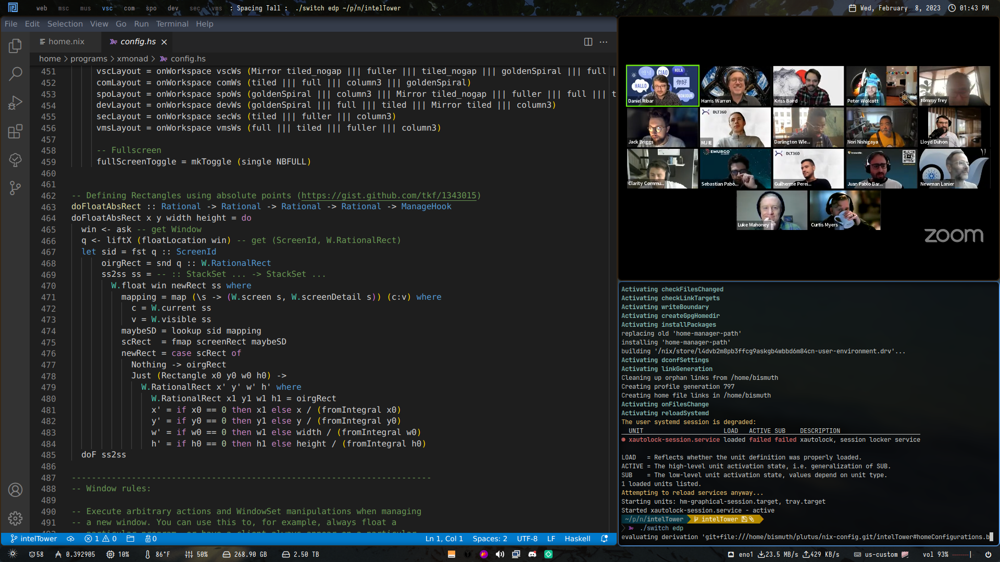

nix-config for 'intelTower'
==========

[](https://github.com/harryprayiv/nix-config/actions)
[](https://github.com/harryprayiv/nix-config/actions)

My current evolving NixOS Cardano SPO/dev environment with full configuration files, home-manager, neovim, etc. 

My intent is to fork and strip this config down to share a collection of rolling, accurate, canonical Cardano dev/SPO/ecosystem configurations in one place. 

## Web Workspace

## Misc Workspace

## Music Workspace

## VsCodium Workspace

## Communications Workspace

## Stake Pool Workspace

## Dev Workspace

## Security Workspace

## Virtual Machine Workspace


## Cardano Font


I am currently in the process of building [cardanofont: a font containing many of the logos in the Cardano ecosystem](https://github.com/Cardano-on-Nix/cardanofont) and incorporating it into my config.


## Structure

Here is an overview of the folders' structure:

```
.
├── build
├── flake.nix
├── flake.lock
├── home
│  ├── config.nix
│  ├── home.nix
│  ├── modules
│  ├── overlays
│  ├── programs
│  ├── scripts
│  ├── services
│  └── themes
├── imgs
├── secrets
└── system
   ├── cachix
   ├── cachix.nix
   ├── configuration.nix
   ├── fonts
   ├── machine
   ├── misc
   └── wm
```

- `build`: the build and installation script.
- `flake.nix`: home and system configurations.
- `home`: all the user programs, services and dotfiles.
- `imgs`: screenshots and other images.
- `system`: the NixOS configuration, settings for different laptops and window managers.

## Install

You can have a look at the available flake outputs before getting started.
(This won't work because I have my config obfuscated in parts)

```console
$ nix flake show github:harryprayiv/nix-config
github:harryprayiv/nix-config/
├───homeConfigurations: unknown
└───nixosConfigurations
    ├───intelNUC: NixOS configuration
    ├───intelTower: NixOS configuration
    └───plutus_vm: NixOS configuration
```

As well as all the declared flake inputs.

```console
$ nix flake metadata github:harryprayiv/nix-config
Resolved URL:  github:harryprayiv/nix-config
Locked URL:    github:harryprayiv/nix-config/69c395a7f8b0911f431c6a081024205bdb042d88
Description:   harryprayiv's Home Manager & NixOS configurations
Path:          /nix/store/a1m0kmyrrrpraj8x7jcjdvyr8dgj4xh6-source
Revision:      69c395a7f8b0911f431c6a081024205bdb042d88
Last modified: 2023-01-06 16:27:31
Inputs:

├───fish-bobthefish-theme: github:gvolpe/theme-bobthefish/e4418e8a7de9fbd6b5053a9b9009aa84a48398cd
├───fish-keytool-completions: github:ckipp01/keytool-fish-completions/dcb24bae7b8437e1e1210b00b7172841a26d6573
├───gh-md-toc: github:ekalinin/github-markdown-toc/661b5c5111f47174e2d9092c8d76867e5a1f249d
├───home-manager: github:nix-community/home-manager/54245e1820caabd8a0b53ce4d47e4d0fefe04cd4
├───neovim-flake: github:gvolpe/neovim-flake/7cf22b0e4bab8935615339ab7c3be4215471896b
├───nixpkgs: github:NixOS/nixpkgs/9813adc7f7c0edd738c6bdd8431439688bb0cb3d
├───nixpkgs-nautilus-gtk3: github:NixOS/nixpkgs/37bd39839acf99c5b738319f42478296f827f274
├───nurpkgs: github:nix-community/NUR/f147ac90edce3f61ca8bb5f883400267a1057987
├───tex2nix: github:Mic92/tex2nix/9ec1c0cd8eecf938f4954c53755c4564679486d9
├───haskellNix: github:input-output-hk/haskell.nix/895435f1893db0ff3666f25ed7d6c92c78673322
├───iohkNix: github:input-output-hk/iohk-nix/ca3d466ed36011bcc14290c6d36c503eb03eb71b
└───cardano-node: github:input-output-hk/cardano-node/f75ed7755dc3ed77fd53c1cbbec6bf8a4f15a1b2
```

### NixOS

The full home configuration is not yet fully automated but the NixOS configuration can be installed by running the following command.

```console
$ nixos-rebuild switch --flake github:harryprayiv/nix-config#intelTower
```

Beware that the `hardware-configuration.nix` file is the result of the hardware scan of the specific machine and might not be suitable for yours.

### Home Manager

A fresh install requires the creation of certain directories so this has not been automated yet (see `build` script file). However, if you omit those steps, the entire HM configuration can also be built as any other flake.

```console
$ nix build github:harryprayiv/nix-config#homeConfigurations.bismuth-edp.activationPackage
$ result/activate
```

### Full configuration via script

On a fresh NixOS installation, run the following commands.

```console
$ nix flake clone github:harryprayiv/nix-config --dest /choose/a/path
$ nix run nixpkgs#git-crypt unlock
$ ./build fresh-install # requires sudo
```

> Note that `git-crypt unlock` requires your GPG Keys to be correctly set up.

The `build` script is only suitable for a fresh install customized to my personal use but you can build the flakes directly. E.g.

```console
$ nix build .#nixosConfigurations.intelTower.config.system.build.toplevel
$ sudo result/bin/switch-to-configuration switch
```

Or for Home Manager.

```console
$ nix build .#homeConfigurations.bismuth-edp.activationPackage
$ result/activate
```